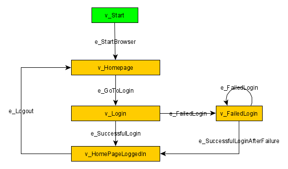

# Model Based Selenium Testing
Simple model based Selenium testing on HackerNews. Represent the login section as a directed graph where the functionality is implemented in Selenium, and then use GraphWalker to iterate over all the edges. 

  

